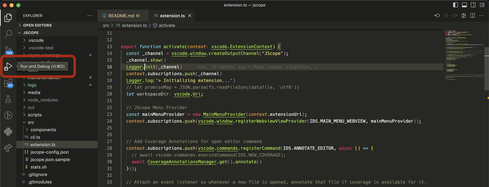
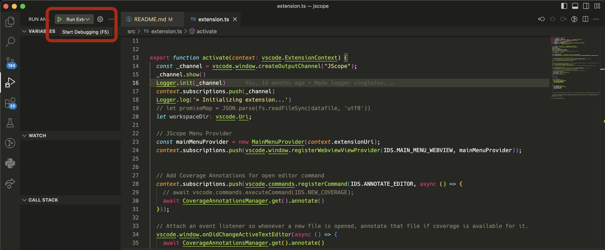
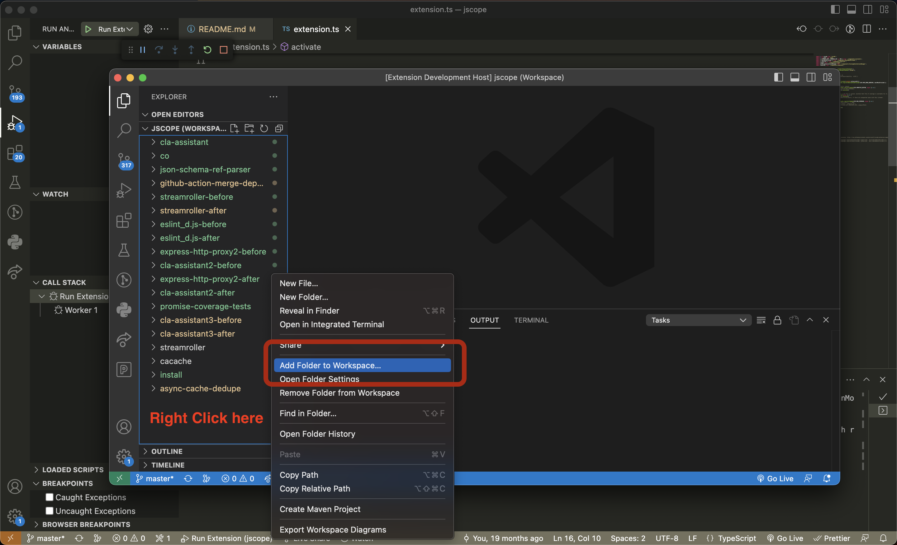
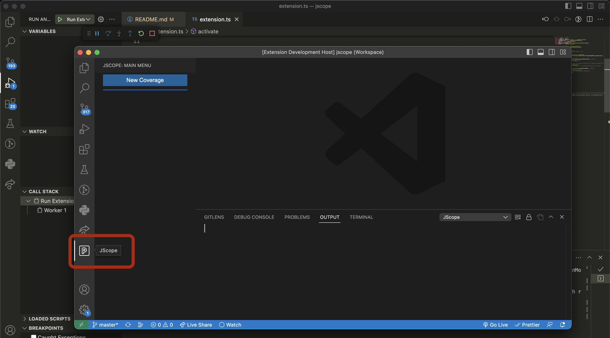

# JScope – Javascript Async Coverage VScode Extension

Cite [here](http://#TODO:acm-dl-virtual-machine).

Related paper: [Code Coverage Criteria for Asynchronous Programs](#TODO:-doi).

<!-- Install the standalone extension from the [VScode extensions marketplace](#TODO:-link-to-extension-marketplace.). -->

## Getting Started

1. Install global dependencies. To use JScope, you need these installed on your machine:
    - [Visual Studio Code](https://code.visualstudio.com/download)
    - [Typescript](https://www.typescriptlang.org/download)
    - [Nodeprof.js](https://github.com/Haiyang-Sun/nodeprof.js): Follow the repository's readme up to a point where you can succesfully run Nodeprof.js. See [instrumentation/README.md](instrumentation/README.md) for more details on how we use Nodeprof.js.

2. Configuration
    - Open [`src/jscope-config.json`](src/jscope-config.json) and set `nodeprof_path` to the directory of nodeprof you installed from step 1.
    - Open [`instrumentation/nodeprof.sh`](instrumentation/nodeprof.sh) and update `javaHome` variable to point to a GraalVM-compatible version. You either had it installed on your machine, or freshly installed another version, updated `javaHome` variable accordingly. You should also add path/to/mx directory to your path in the same file.
     
3. Compile. 
    - Run `npm run build` to install packages used in JScope, and compile the typescript project.

## Running JScope in debug mode

After building the project, you can run JSCope by clicking on the
"Run extension" button from the "Run and debug" panel in VSCode. (You can also use the F5 shortcut as well)

A new VSCode window will appears, which has JScope installed. 

To measure coverage for any repository, it should be added to the current VSCode workspace, right click on the side panel, click "Add Folder to Workspace" and add your desired node.js project.

Now select the P icon on the primary sidebar. It should open Jscope's menu.

From there, select the "New Coverage" Button, and select a project from the drop-down menu that appears.

Wait until instrumentation and calculation of the coverage. You can also see the logs in the debug console.

## For researchers and maintainers.

- [Developer's guide](docs/developers-guide.md):
If you want to build, test, or extend JScope. 
Contains information about the components of JScope.
- [User study materials](https://github.com/MohGanji/jscope-user-study), including tasks and pre-questionnaire.
