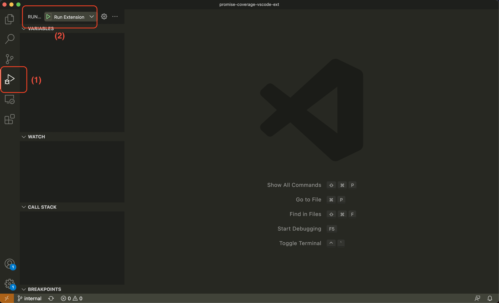
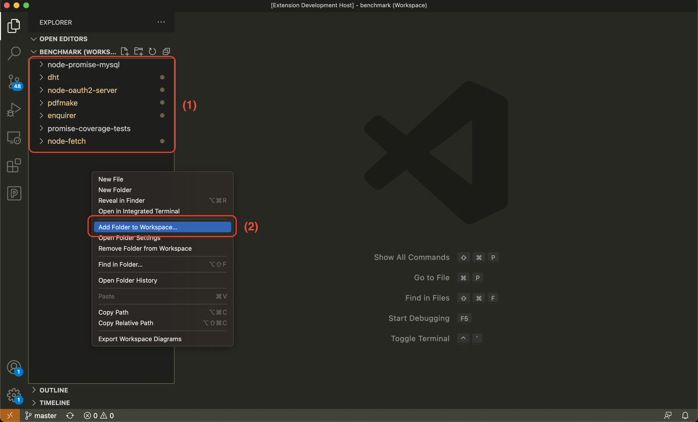
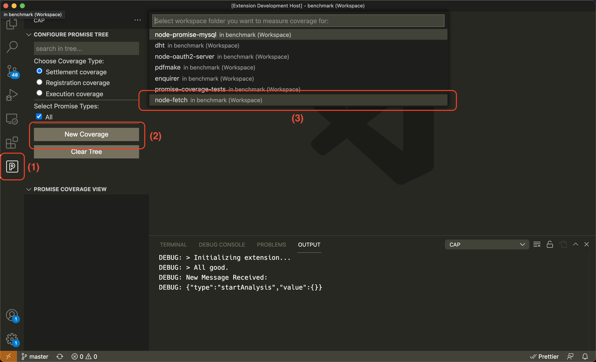

# Javascript Async Coverage VScode Extension

## Instructions for internal use:

1. Clone the project and switch to `internal` branch:
```sh
git checkout internal
```

2. Install dependencies and build the project using the command below:
```sh
npm run build
```

2. Run the extension pressing `f5` key or by clicking on the Run Extension button from the `Run and Debug` panel on the left sidebar, as shown in the image below:


3. Clone [benchmark projects listed below](#benchmark-projects) on your machine and add them to the workspace that opens up, containing our extension.

box (1) shows open projects in this vscode window, you can add a new folder to workspace by right clicking on the side panel and selecting `Add folder to workspace` option.

4. Select the coverage extension from the left sidebar and click on `New Coverage` button. Then select a project and wait for the promise tree to be updated.



### <a name="benchmark-projects">Here is the list of currently available benchmark projects</a>

* `node-fetch`: [github link](https://github.com/node-fetch/node-fetch)
* `promise-coverage-tests`: [github link](https://github.com/MohGanji/promise-coverage-tests)
* `honoka`: [github link](https://github.com/kokororin/honoka.git) - run `npm i; npm run build` after cloning.
* `fetchr`: [github link](https://github.com/yahoo/fetchr.git) - partial logs